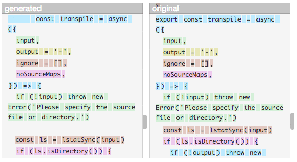
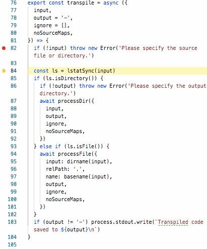

# ÀLaMode

[](https://npmjs.org/package/alamode)

_ÀLaMode_ is a RegExp-based transpiler of source code in _Node.JS_ that supports transpilation of `import` and `export` statements including source map for debugging, while keeping the original code pretty much the same (no _interrop_ require). It also can transpile JSX (without source maps ATM and some minor limitations).

The package can be used via the [CLI](#CLI) to build packages, or via the [require hook](#require-hook) to transform modules on-the-fly.

> If you've tried it and are having trouble seeing `unknown keyword export`, check if your issue falls under the category described in the [troubleshooting](#troubleshooting). That's the single problem that we've seen after a year of using this software.

```
yarn add -D alamode
```

<p align="center"><a href="#table-of-contents"></a></p>

## Why ÀLaMode

ÀLaMode is a neat, fast, low-weight alternative to AST-based transpilers. If you only want `import` and `export` statements, don't disrespect yourself by continuing to use _Babel_, and make a switch to **ÀLaMode** today. What am I talking about? Read next.

<p align="center"><a href="#table-of-contents"></a></p>

### It's Neat

The source code is left pretty much intact, with line numbers preserved, and exports just being renamed to `module.export` while making sure to export the default module first if it is present. There is no need to come up with super-fancy solutions and try to build a rocket when all you need is a remote control. That means, don't worry about EcmaScript modules standard, it's significance is blown out of proportions by the "community" who has nothing better to do. Just rename <kbd>exports</kbd> to <kbd>module.exports</kbd> and <kbd>imports</kbd> to <kbd>require</kbd> &mdash; that's the philosophy behind _ÀLaMode_.

<table>
<tr><th>Source Code</th><th>Transpiled Code</th></tr>
<tr><td>

```js
import Stream, {
  Transform,
} from 'stream'
import { join } from 'path'

export default class S extends Transform {
  /**
   * Creates a new instance.
   * @param {string} path
   * @param {Stream} [parent]
   */
  constructor(path, parent) {
    super()
    this.source = join('example', path)
    if (parent instanceof Stream)
      this.pipe(parent)
  }
}

/**
 * A function that returns `c`.
 * @param {string} input
 */
export const c = (input = '') => {
  return 'c' + input ? `-${input}` : ''
}

/**
 * A function that returns `b`.
 * @param {number} times
 */
export const b = (times = 0) => {
  return 'b' + times ? `-${times}` : ''
}
```
```


```
</td>
<td>

```js
const Stream = require('stream'); const {
  Transform,
} = Stream;
const { join } = require('path');

class S extends Transform {
  /**
   * Creates a new instance.
   * @param {string} path
   * @param {Stream} [parent]
   */
  constructor(path, parent) {
    super()
    this.source = join('example', path)
    if (parent instanceof Stream)
      this.pipe(parent)
  }
}

/**
 * A function that returns `c`.
 * @param {string} input
 */
const c = (input = '') => {
  return 'c' + input ? `-${input}` : ''
}

/**
 * A function that returns `b`.
 * @param {number} times
 */
const b = (times = 0) => {
  return 'b' + times ? `-${times}` : ''
}

module.exports = S
module.exports.c = c
module.exports.b = b
```
</td></tr>
</table>

<details>
<summary>Show Babel Output</summary>

```js
"use strict";

Object.defineProperty(exports, "__esModule", {
  value: true
});
exports.b = exports.c = exports.default = void 0;

var _stream = _interopRequireWildcard(require("stream"));

var _path = require("path");

function _interopRequireWildcard(obj) { if (obj && obj.__esModule) { return obj; } else { var newObj = {}; if (obj != null) { for (var key in obj) { if (Object.prototype.hasOwnProperty.call(obj, key)) { var desc = Object.defineProperty && Object.getOwnPropertyDescriptor ? Object.getOwnPropertyDescriptor(obj, key) : {}; if (desc.get || desc.set) { Object.defineProperty(newObj, key, desc); } else { newObj[key] = obj[key]; } } } } newObj.default = obj; return newObj; } }

class S extends _stream.Transform {
  /**
   * Creates a new instance.
   * @param {string} path
   * @param {Stream} [parent]
   */
  constructor(path, parent) {
    super();
    this.source = (0, _path.join)('example', path);
    if (parent instanceof _stream.default) this.pipe(parent);
  }

}
/**
 * A function that returns `c`.
 * @param {string} input
 */


exports.default = S;

const c = (input = '') => {
  return 'c' + input ? `-${input}` : '';
};
/**
 * A function that returns `b`.
 * @param {number} times
 */


exports.c = c;

const b = (times = 0) => {
  return 'b' + times ? `-${times}` : '';
};

exports.b = b;
```
</details>

<p align="center"><a href="#table-of-contents"></a></p>

### It Has 0 Dependencies

ÀLaMode does not install any additional dependencies, and it has been optimised with _Google Closure Compiler_. That means you don't have to wait ages for each new real dependency in your project to link with Babel's bloatware you don't care about. Just focus on the work and enjoy the single new directory in your `node_modules`.

<table>
<tr><th>ÀLaMode: 8 yarn.lock lines</th><th>Babel: 1650 yarn.lock Lines</th></tr>
<tr><td>

</td>
<td>

</td></tr>
</table>

<p align="center"><a href="#table-of-contents"></a></p>

### It Respects JSDoc

Let's face it, _Babel_ is software for masses that has capitalized on people's vulnerability in wanting to use `import` and `export` statements which is one of the best features on the language. You say let them be, I say look what they are doing to your documented code without caring a single bit:

<table>
<tr><th>ÀLaMode: Gold Standard</th><th>Babel: JSDoc Enemy</th></tr>
<tr><td>

</td>
<td>

</td></tr>
</table>

Original Source:

```js
/**
 * A function that returns `b`.
 * @param {number} times
 */
export const b = (times) => {
  return 'b' + (times ? `-${times}` : '')
}
```

See if you can figure out [why this happens](https://github.com/a-la/fixture-babel/blob/master/build/index.js#L31). To us, a [Node.JS Development Company](https://artd.eco) that puts developer experience and quality of software on the first place, it is a crime against all web software engineers to become a _JavaScript_ utility used by millions of people, and then destroy everyone's JSDoc just like that. Please remove _Babel_ from all your computers, and spread the word about ÀLaMode using buttons below [please bear with me for the buttons].

<p align="center"><a href="#table-of-contents"></a></p>

## Table Of Contents

- [Why ÀLaMode](#why-àlamode)
  * [It's Neat](#its-neat)
  * [It Has 0 Dependencies](#it-has-0-dependencies)
  * [It Respects JSDoc](#it-respects-jsdoc)
- [Table Of Contents](#table-of-contents)
- [Installation](#installation)
  * [Global](#global)
  * [Project](#project)
- [CLI](#cli)
  * [`NODE_DEBUG`](#node_debug)
  * [`--help`](#--help)
- [Compiling JSX: `--jsx, --preact`](#compiling-jsx---jsx---preact)
  * [CSS Injector](#css-injector)
- [ÀLaNode](#àlanode)
- [.alamoderc.json](#alamodercjson)
- [Transforms](#transforms)
  * [`@a-la/import`](#a-laimport)
    * [esModule](#esmodule)
    * [Replace Path](#replace-path)
  * [`@a-la/export`](#a-laexport)
- [Require Hook](#require-hook)
  * [`_alamode.HookConfig`](#type-_alamodehookconfig)
  * [Multiple Calls To Alamode()](#multiple-calls-to-alamode)
- [Source Maps](#source-maps)
  * [<code>debug session</code>](#debug-session)
- [Troubleshooting](#troubleshooting)
- [Copyright](#copyright)

<p align="center"><a href="#table-of-contents"></a></p>

## Installation

The software can be installed either as a global dependency, or as a project dependency.

### Global

When installed globally, it will be used directly via a binary, such as `alamode src -o build`.

|                                      Package Manager                                      |       Installation        |
| ----------------------------------------------------------------------------------------- | ------------------------- |
|  npm     | `npm i -g alamode` |
|  yarn | `yarn add global alamode` |

### Project

When installed in a project, it will be used via the `package.json` script, e.g., `yarn build` or `npm run build`.

```json5
// package.json
{
  "name": "project",
  "version": "1.0.0",
  "description": "An example project",
  "main": "build",
  "scripts": {
    "build": "alamode src -o build"
  },
  "files": ["build"],
  "license": "MIT"
}
```

|                                      Package Manager                                      |        Installation        |
| ----------------------------------------------------------------------------------------- | -------------------------- |
|  npm     | `npm i --save-dev alamode` |
|  yarn | `yarn add -DE alamode` |

<p align="center"><a href="#table-of-contents"></a></p>

## CLI

The binary accepts a path to a single file, or a directory with the source code as the first argument, and a path to the build folder via `-o` argument.

```sh
alamode src -o build
```

There are other arguments which can be passed.

<table>
  <tr><th>Argument</th><th>Short</th><th>Description</th></tr>
  <tr><td>source</td><td></td><td>
    The location of the input file or directory to transpile.
  </td>
  </tr>
  <tr><td>--output</td><td>-o</td><td>
    The location of where to save the transpiled output.
  </td>
  </tr>
  <tr><td>--version</td><td>-v</td><td>Show the version number.</td></tr>
  <tr><td>--help</td><td>-h</td><td>Display the usage information.</td></tr>
  <tr>
    <td>--ignore</td>
    <td>-i</td>
    <td>
      Comma-separated list of files inside of <code>source</code> dir to
          ignore, for example, <code>bin,.eslintrc</code>.
    </td>
  </tr>
  <tr><td>--noSourceMaps</td><td>-s</td><td>Disable source maps.</td></tr>
  <tr><td>--extensions</td><td>-e</td><td>
    Files of what extensions to transpile. Default <code>js,jsx</code>.
  </td>
  </tr>
  <tr>
    <td>--jsx</td>
    <td>-j</td>
    <td>
      Enable JSX mode: only update JSX syntax to use hyperscript.
          Does not transpile <code>import/export</code> statements.
    </td>
  </tr>
  <tr>
    <td>--preact</td>
    <td>-p</td>
    <td>
      When transpiling JSX, automatically insert at the top
          <code>import { h } from "preact"</code>.
    </td>
  </tr>
  <tr><td>--debug</td><td>-d</td><td>
    Will make ÀLaMode stop after replacing markers.
  </td>
  </tr>
</table>

Setting the <a name="node_debug">`NODE_DEBUG`</a> environmental variable to `alamode` will print the list of processed files to the `stderr`.

```sh
$ NODE_DEBUG=alamode alamode src -o build -i bin/alamode.js
```

```fs
ALAMODE 97955: index.js
ALAMODE 97955: bin/catcher.js
ALAMODE 97955: bin/index.js
ALAMODE 97955: lib/index.js
```

<p align="center"><a href="#table-of-contents"></a></p>

### `--help`

Shows all available commands.

```
A tool to transpile JavaScript packages using regular expressions.
Supports import/export and JSX transpilation.
https://artdecocode.com/alamode/

  alamode source [-o destination] [-i dir,file] [-s] [-jp]

	source            	The location of the input file or directory to transpile.
	--output, -o      	The location of where to save the transpiled output.
	--version, -v     	Show the version number.
	--help, -h        	Display the usage information.
	--ignore, -i      	Comma-separated list of files inside of `source` dir to
	                  	ignore, for example, `bin,.eslintrc`.
	--noSourceMaps, -s	Disable source maps.
	--extensions, -e  	Files of what extensions to transpile.
	                  	Default: js,jsx.
	--jsx, -j         	Enable JSX mode: only update JSX syntax to use hyperscript.
	                  	Does not transpile `import/export` statements.
	--preact, -p      	When transpiling JSX, automatically insert at the top
	                  	`import { h } from "preact"`.
	--debug, -d       	Will make ÀLaMode stop after replacing markers.

  Example:

    alamode src -o build
```

<p align="center"><a href="#table-of-contents"></a></p>

## Compiling JSX: `--jsx, --preact`

ÀLaMode can transpile JSX syntax. In the `jsx` mode, the `import/export` statements will be left intact, but the source code will be transformed to add pragma invocations, such as `h(Component, { props }, children)`. The default pragma is `h` for Preact, and to avoid writing `import { h } from 'preact'` in each file, the `-p` option can be passed for ÀLaMode to add it automatically.

_For example, the following file can be compiled:_

```jsx
import { render } from 'preact'

const Component = ({ test, ...props }) => (
  <div id="example" {...props}>
    {test}
  </div>
)
render(<Component cool>Example</Component>, document.body)
```

_Using the `alamode example/index.jsx -j -p` command:_

```js
import { h } from 'preact'
import { render } from 'preact'

const Component = ({ test, ...props }) => (
   h('div',{...props,'id':"example"},
    test,
  )
)
render( h(Component,{cool:true},`Example`), document.body)
```

<p align="center"><a href="#table-of-contents"></a></p>

### CSS Injector

_ÀLaMode_ can transpile the `import './style.css'` directives into `import './style.css.js'`, where `style.css.js` becomes a module with a css-injector script that will add your CSS to the `head` element.

<p align="center"><a href="#table-of-contents"></a></p>

## ÀLaNode

To be able to spawn modules without having to create a proxy file as below:

```js
require('alamode')()
require('./package')
```

ÀLaMode bundles a binary called `alanode`. It will do the same thing as above, so that running modules with `import` and `export` statements becomes really easy.

```sh
$ alanode source
```

It changes `import` and `export` statements into `require` calls and `module.export` expressions. It also normalises `process.argv` to hide its presence, so that programs can safely keep using the _argv_ array without unexpected results.

_With the following file that uses an import_:

```js
import { constants } from 'os'
console.log(process.argv)
console.log(constants.signals.SIGINT)
```

_`$ alanode t` will generate the result successfully:_

```
[ '/Users/zavr/.nvm/versions/node/v8.15.0/bin/node',
  '/Users/zavr/a-la/alamode/test/fixture/t' ]
2
```

<blockquote>

ÀLaNode is also available as a standalone package `alanode`.<br>
[](https://npmjs.org/package/alanode)
</blockquote>

<p align="center"><a href="#table-of-contents"></a></p>

## .alamoderc.json

A transform can support options which are set in the `.alamoderc.json` configuration file. The configuration file is read from the same directory where the program is executed (cwd). Options inside of the `env` directive will be active only when the `ALAMODE_ENV` environmental variable is set to the `env` key.

```json
{
  "env": {
    "test-build": {
      "import": {
        "replacement": {
          "from": "^((../)+)src",
          "to": "$1build"
        }
      }
    }
  },
  "import": {
    "alamodeModules": ["alamode", "example"]
  }
}
```

<p align="center"><a href="#table-of-contents"></a></p>

## Transforms

There are a number of built-in transforms, which don't need to be installed separately because their size is small enough to be included as direct dependencies.

### `@a-la/import`

Changes all `import` statements into `require` statements. Although the specification between the [ECMAScript Modules](https://nodejs.org/api/esm.html) and [Modules](https://nodejs.org/api/modules.html) is different, most developers will prefer to use `import` just because of its neater syntax.

```js
import argufy from 'argufy'
import restream, {
  Replaceable,
  makeMarkers, makeCutRule, makePasteRule,
} from 'restream'
import { resolve, join } from 'path'
import { version } from '../../package.json'
import erte, { c } from './erte'
```

```js
const argufy = require('argufy');
let restream = require('restream'); const {
  Replaceable,
  makeMarkers, makeCutRule, makePasteRule,
} = restream; if (restream && restream.__esModule) restream = restream.default;
const { resolve, join } = require('path');
const { version } = require('../../package.json');
const erte = require('./erte'); const { c } = erte;
```

The options that can be set in the `.alamoderc.json` are described below.

#### esModule

The `if (dependency && dependency.__esModule) dependency = dependency.default;` check is there to make `alamode` compatible with _Babel_ and _TypeScript_ that export default modules as the `default` property of `module.exports` object and set the `__esModule` marker to true, e.g.,

```js
Object.defineProperty(exports, "__esModule", {
  value: true
});
exports.default = method;
```

The check will only work for external modules, and the _Node.JS_ core dependencies as well as those that start with `.` or `/` will be required without the `__esModule` check. To enforce the check for any file, the `esCheck: always` should be set in the transform configuration. To disable the check for specific modules, they are added to the `alamodeModules` directive.

```json5
{
  "import": {
    "esCheck": "always", // adds the check for each default import
    "alamodeModules": ["restream"] // disables the check for packages
  }
}
```

If neither `esCheck` nor `alamodeModules` are present, _ÀLaMode_ will look up the _package.json_ of the module and see if it includes the `"alamode": true` property, and won't add the check if it does.

#### Replace Path

This transform supports an option to replace the path to the required file using a regular expression. This can be useful when running tests against the build directory, rather than source directory.

```json5
{
  "import": {
    "replacement": {
        "from": "^((../)+)src",
          "to": "$1build"
      }
    }
  }
}
```

<table>
<tr><th><a href="example/index.js">Source</a></th><th>Replaced Source</th></tr>
<tr><td>

```js
import myPackage from '../src'

(async () => {
  await myPackage()
})()
```
</td>
<td>

```js
const myPackage = require('../build');

(async () => {
  await myPackage()
})()
```
</td></tr>
</table>

<p align="center"><a href="#table-of-contents"></a></p>

### `@a-la/export`

Transforms all `export` statements into `module.exports` statements.

<table>
<thead>
<tr>
<th>Input</th>
<th>Output</th>
</tr>
</thead>
<tbody>
 <tr/>
 <tr>
  <td>

```js
export async function example () {}

const example2 = () => {}

export default class Example {
  constructor() {
    example()
  }
}

export { example2 as alias }
```
  </td>
  <td>

```js
async function example () {}

const example2 = () => {}

class Example {
  constructor() {
    example()
  }
}


module.exports = Example
module.exports.example = example
module.exports.alias = example2
```
  </td>
 </tr>
</tbody>
</table>

There are some [limitations](https://github.com/a-la/export#limitations) one should be aware about, however they will not typically cause problems for a Node.JS package. The line and column numbers are preserved for easier generation of the source maps when using the require hook and when source maps are not skipped with `-s` option. When `-s` is given, on the other hand, _ÀLaMode_ will remove any unnecessary whitespace that usually fills in the `export` length.


<p align="center"><a href="#table-of-contents"></a></p>

## Require Hook

The purpose of the require hook is to be able to transpile files automatically when they are imported.

To use this feature, `alamode` needs to be `required` in a separate file, after which the `import` and `export` statements will become available.

For example, take the following directory structure, with a main and library files:

```m
example/require
├── index.js
├── lib.js
├── multiple.js
└── require.js
```

<table>
<thead>
<tr>
<th><code>index.js</code></th>
<th><code>lib.js</code></th>
</tr>
</thead>
<tbody>
<tr/><tr>
<td>

```js
import getInfo from './lib'

console.log(getInfo())
```
</td>
<td>

```js
import { platform, arch } from 'os'

export default () => {
  return `${platform()}:${arch()}`
}
```
</td>
</tr>
</tbody>
</table>


The require hook would work in the following way:

```js
require('alamode')()
require('.')
```

By executing the `node require.js` command, `alamode` will be installed and it will do its job dynamically for every `.js` file that is required, enabling to use `import` and `export` statements.

```
darwin:x64
```

__<a name="type-_alamodehookconfig">`_alamode.HookConfig`</a>__: The options for ÀLaMode Hook.

|       Name        |                Type                |                                           Description                                            | Default |
| ----------------- | ---------------------------------- | ------------------------------------------------------------------------------------------------ | ------- |
| pragma            | <em>string</em>                    | What pragma to add on top of JSX programs. Default `const { h } = require('preact');`.           | -       |
| noWarning         | <em>boolean</em>                   | Disable warnings when resetting existing hooks.                                                  | `false` |
| matcher           | <em>function(string): boolean</em> | The function that will be called with the path and return whether the file should be transpiled. | `null`  |
| ignoreNodeModules | <em>boolean</em>                   | Auto-ignore node_modules. Independent of any matcher.                                            | `true`  |

<p align="center"><a href="#table-of-contents"></a></p>

### Multiple Calls To Alamode()

When the call is made multiple times in the program, the latter calls will revert the previous hooks and install new ones. The warning will be shown unless the `noWarning` option is set to true.

```js
const alamode = require('alamode')
alamode()

// in other file
const path = require('path')
const preact = path.relative('', path
  .dirname(require.resolve('preact/package.json')))
alamode({
  pragma: `const { h } = require("./${preact}");`,
  // noWarning: true, // to disable output
})
```

```
Reverting JS hook to add new one.
Reverting JSX hook to add new one, pragma:
const { h } = require("./node_modules/preact");
```

This can happen when the tests are set up to run with _Zoroaster_ with the `-a` flag for alamode, and the source code also tries to install the require hook.

<p align="center"><a href="#table-of-contents"></a></p>

## Source Maps

The source maps are supported by this package, but implemented in a hack-ish way. The transforms will aim to preserve line and column numbers, so that no additional remapping is required. However this is not enough to generate a source map good enough for a debugger -- it needs to know about mappings of positions between segments which can be operators, function calls, _etc_. `alamode` simply breaks the source code into distinct chunks such as white-spaces, identifiers and comments, and down into individual symbols. Using this method, the size of a source map is larger, but it still works. In further versions, this will be improved to allow to extract real segments.

[](http://sokra.github.io/source-map-visualization/#base64,Y29uc3QgeyBqb2luLCBiYXNlbmFtZSwgZGlybmFtZSB9ID0gcmVxdWlyZSgncGF0aCcpCmNvbnN0IHsgbHN0YXRTeW5jIH0gPSByZXF1aXJlKCdmcycpCmxldCByZWFkRGlyU3RydWN0dXJlID0gcmVxdWlyZSgnQHdyb3RlL3JlYWQtZGlyLXN0cnVjdHVyZScpOyBpZiAocmVhZERpclN0cnVjdHVyZSAmJiByZWFkRGlyU3RydWN0dXJlLl9fZXNNb2R1bGUpIHJlYWREaXJTdHJ1Y3R1cmUgPSByZWFkRGlyU3RydWN0dXJlLmRlZmF1bHQ7CmxldCBlbnN1cmVQYXRoID0gcmVxdWlyZSgnQHdyb3RlL2Vuc3VyZS1wYXRoJyk7IGlmIChlbnN1cmVQYXRoICYmIGVuc3VyZVBhdGguX19lc01vZHVsZSkgZW5zdXJlUGF0aCA9IGVuc3VyZVBhdGguZGVmYXVsdDsKY29uc3QgeyBkZWJ1Z2xvZyB9ID0gcmVxdWlyZSgndXRpbCcpCmNvbnN0IHsgY29weU1vZGUgfSA9IHJlcXVpcmUoJy4uL2xpYicpCmxldCB3cml0ZVNvdXJjZU1hcCA9IHJlcXVpcmUoJy4uL2xpYi9zb3VyY2UtbWFwJyk7IGlmICh3cml0ZVNvdXJjZU1hcCAmJiB3cml0ZVNvdXJjZU1hcC5fX2VzTW9kdWxlKSB3cml0ZVNvdXJjZU1hcCA9IHdyaXRlU291cmNlTWFwLmRlZmF1bHQ7CmNvbnN0IHsgdHJhbnNmb3JtU3RyZWFtIH0gPSByZXF1aXJlKCcuLi9saWIvdHJhbnNmb3JtJykKCmNvbnN0IExPRyA9IGRlYnVnbG9nKCdhbGFtb2RlJykKCmNvbnN0IHByb2Nlc3NGaWxlID0gYXN5bmMgKHsKICBpbnB1dCwgcmVsUGF0aCwgbmFtZSwgb3V0cHV0LCBpZ25vcmUsIG5vU291cmNlTWFwcywKfSkgPT4gewogIGNvbnN0IGZpbGUgPSBqb2luKHJlbFBhdGgsIG5hbWUpCiAgaWYgKGlnbm9yZS5pbmNsdWRlcyhmaWxlKSkgcmV0dXJuCgogIGNvbnN0IGlzT3V0cHV0U3Rkb3V0ID0gb3V0cHV0ID09ICctJwogIGNvbnN0IHNvdXJjZSA9IGpvaW4oaW5wdXQsIGZpbGUpCgogIGNvbnN0IG91dHB1dERpciA9IGlzT3V0cHV0U3Rkb3V0ID8gbnVsbCA6IGpvaW4ob3V0cHV0LCByZWxQYXRoKQogIGNvbnN0IGRlc3RpbmF0aW9uID0gaXNPdXRwdXRTdGRvdXQgPyAnLScgOiBqb2luKG91dHB1dERpciwgbmFtZSkKICBMT0coZmlsZSkKCiAgYXdhaXQgZW5zdXJlUGF0aChkZXN0aW5hdGlvbikKCiAgY29uc3Qgb3JpZ2luYWxTb3VyY2UgPSBhd2FpdCB0cmFuc2Zvcm1TdHJlYW0oewogICAgc291cmNlLAogICAgZGVzdGluYXRpb24sCiAgfSkKCiAgaWYgKG91dHB1dCAhPSAnLScpIHsKICAgIGNvcHlNb2RlKHNvdXJjZSwgZGVzdGluYXRpb24pCiAgICBpZiAobm9Tb3VyY2VNYXBzKSByZXR1cm4KICAgIHdyaXRlU291cmNlTWFwKHsKICAgICAgZGVzdGluYXRpb24sCiAgICAgIGZpbGUsCiAgICAgIG5hbWUsCiAgICAgIG91dHB1dERpciwKICAgICAgc291cmNlLAogICAgICBvcmlnaW5hbFNvdXJjZSwKICAgIH0pCiAgfQp9Cgpjb25zdCBwcm9jZXNzRGlyID0gYXN5bmMgKHsKICBpbnB1dCwKICBvdXRwdXQsCiAgcmVsUGF0aCA9ICcuJywKICBpZ25vcmUgPSBbXSwKICBub1NvdXJjZU1hcHMsCn0pID0+IHsKICBjb25zdCBwYXRoID0gam9pbihpbnB1dCwgcmVsUGF0aCkKICBjb25zdCB7IGNvbnRlbnQgfSA9IGF3YWl0IHJlYWREaXJTdHJ1Y3R1cmUocGF0aCkKICBjb25zdCBrID0gT2JqZWN0LmtleXMoY29udGVudCkKICBhd2FpdCBrLnJlZHVjZShhc3luYyAoYWNjLCBuYW1lKSA9PiB7CiAgICBhd2FpdCBhY2MKICAgIGNvbnN0IHsgdHlwZSB9ID0gY29udGVudFtuYW1lXQogICAgaWYgKHR5cGUgPT0gJ0ZpbGUnKSB7CiAgICAgIGF3YWl0IHByb2Nlc3NGaWxlKHsKICAgICAgICBpbnB1dCwgcmVsUGF0aCwgbmFtZSwgb3V0cHV0LCBpZ25vcmUsIG5vU291cmNlTWFwcywKICAgICAgfSkKICAgIH0gZWxzZSBpZiAodHlwZSA9PSAnRGlyZWN0b3J5JykgewogICAgICBjb25zdCBuZXdSZWxQYXRoID0gam9pbihyZWxQYXRoLCBuYW1lKQogICAgICBhd2FpdCBwcm9jZXNzRGlyKHsKICAgICAgICBpbnB1dCwKICAgICAgICBvdXRwdXQsCiAgICAgICAgaWdub3JlLAogICAgICAgIHJlbFBhdGg6IG5ld1JlbFBhdGgsCiAgICAgICAgbm9Tb3VyY2VNYXBzLAogICAgICB9KQogICAgfQogIH0sIFByb21pc2UucmVzb2x2ZSgpKQp9CgogICAgICAgY29uc3QgdHJhbnNwaWxlID0gYXN5bmMgKHsKICBpbnB1dCwKICBvdXRwdXQgPSAnLScsCiAgaWdub3JlID0gW10sCiAgbm9Tb3VyY2VNYXBzLAp9KSA9PiB7CiAgaWYgKCFpbnB1dCkgdGhyb3cgbmV3IEVycm9yKCdQbGVhc2Ugc3BlY2lmeSB0aGUgc291cmNlIGZpbGUgb3IgZGlyZWN0b3J5LicpCgogIGNvbnN0IGxzID0gbHN0YXRTeW5jKGlucHV0KQogIGlmIChscy5pc0RpcmVjdG9yeSgpKSB7CiAgICBpZiAoIW91dHB1dCkgdGhyb3cgbmV3IEVycm9yKCdQbGVhc2Ugc3BlY2lmeSB0aGUgb3V0cHV0IGRpcmVjdG9yeS4nKQogICAgYXdhaXQgcHJvY2Vzc0Rpcih7CiAgICAgIGlucHV0LAogICAgICBvdXRwdXQsCiAgICAgIGlnbm9yZSwKICAgICAgbm9Tb3VyY2VNYXBzLAogICAgfSkKICB9IGVsc2UgaWYgKGxzLmlzRmlsZSgpKSB7CiAgICBhd2FpdCBwcm9jZXNzRmlsZSh7CiAgICAgIGlucHV0OiBkaXJuYW1lKGlucHV0KSwKICAgICAgcmVsUGF0aDogJy4nLAogICAgICBuYW1lOiBiYXNlbmFtZShpbnB1dCksCiAgICAgIG91dHB1dCwKICAgICAgaWdub3JlLAogICAgICBub1NvdXJjZU1hcHMsCiAgICB9KQogIH0KICBpZiAob3V0cHV0ICE9ICctJykgcHJvY2Vzcy5zdGRvdXQud3JpdGUoYFRyYW5zcGlsZWQgY29kZSBzYXZlZCB0byAke291dHB1dH1cbmApCn0KCgptb2R1bGUuZXhwb3J0cy50cmFuc3BpbGUgPSB0cmFuc3BpbGUKLy8jIHNvdXJjZU1hcHBpbmdVUkw9dHJhbnNwaWxlLmpzLm1hcA==,eyJ2ZXJzaW9uIjozLCJzb3VyY2VzIjpbIi4uLy4uL3NyYy9iaW4vdHJhbnNwaWxlLmpzIl0sIm5hbWVzIjpbXSwibWFwcGluZ3MiOiJBQUFBLE1BQU0sQ0FBQyxDQUFDLENBQUMsSUFBSSxDQUFDLENBQUMsUUFBUSxDQUFDLENBQUMsT0FBTyxDQUFDLENBQUMsQ0FBQyxJQUFJLENBQUMsQ0FBQyxJQUFJO0FBQzdDLE1BQU0sQ0FBQyxDQUFDLENBQUMsU0FBUyxDQUFDLENBQUMsQ0FBQyxJQUFJLENBQUMsQ0FBQyxFQUFFO0FBQzdCLE1BQU0sQ0FBQyxnQkFBZ0IsQ0FBQyxJQUFJLENBQUMsQ0FBQyxDQUFDLEtBQUssQ0FBQyxJQUFJLENBQUMsR0FBRyxDQUFDLFNBQVM7QUFDdkQsTUFBTSxDQUFDLFVBQVUsQ0FBQyxJQUFJLENBQUMsQ0FBQyxDQUFDLEtBQUssQ0FBQyxNQUFNLENBQUMsSUFBSTtBQUMxQyxNQUFNLENBQUMsQ0FBQyxDQUFDLFFBQVEsQ0FBQyxDQUFDLENBQUMsSUFBSSxDQUFDLENBQUMsSUFBSTtBQUM5QixNQUFNLENBQUMsQ0FBQyxDQUFDLFFBQVEsQ0FBQyxDQUFDLENBQUMsSUFBSSxDQUFDLENBQUMsQ0FBQyxDQUFDLENBQUMsR0FBRztBQUNoQyxNQUFNLENBQUMsY0FBYyxDQUFDLElBQUksQ0FBQyxDQUFDLENBQUMsQ0FBQyxDQUFDLEdBQUcsQ0FBQyxNQUFNLENBQUMsR0FBRztBQUM3QyxNQUFNLENBQUMsQ0FBQyxDQUFDLGVBQWUsQ0FBQyxDQUFDLENBQUMsSUFBSSxDQUFDLENBQUMsQ0FBQyxDQUFDLENBQUMsR0FBRyxDQUFDLFNBQVM7O0FBRWpELEtBQUssQ0FBQyxHQUFHLENBQUMsQ0FBQyxDQUFDLFFBQVEsQ0FBQyxDQUFDLE9BQU8sQ0FBQzs7QUFFOUIsS0FBSyxDQUFDLFdBQVcsQ0FBQyxDQUFDLENBQUMsS0FBSyxDQUFDLENBQUM7RUFDekIsS0FBSyxDQUFDLENBQUMsT0FBTyxDQUFDLENBQUMsSUFBSSxDQUFDLENBQUMsTUFBTSxDQUFDLENBQUMsTUFBTSxDQUFDLENBQUMsWUFBWTtBQUNwRCxDQUFDLENBQUMsQ0FBQyxDQUFDLENBQUMsQ0FBQztFQUNKLEtBQUssQ0FBQyxJQUFJLENBQUMsQ0FBQyxDQUFDLElBQUksQ0FBQyxPQUFPLENBQUMsQ0FBQyxJQUFJO0VBQy9CLEVBQUUsQ0FBQyxDQUFDLE1BQU0sQ0FBQyxRQUFRLENBQUMsSUFBSSxDQUFDLENBQUMsQ0FBQzs7RUFFM0IsS0FBSyxDQUFDLGNBQWMsQ0FBQyxDQUFDLENBQUMsTUFBTSxDQUFDLENBQUMsQ0FBQyxDQUFDLENBQUMsQ0FBQztFQUNuQyxLQUFLLENBQUMsTUFBTSxDQUFDLENBQUMsQ0FBQyxJQUFJLENBQUMsS0FBSyxDQUFDLENBQUMsSUFBSTs7RUFFL0IsS0FBSyxDQUFDLFNBQVMsQ0FBQyxDQUFDLENBQUMsY0FBYyxDQUFDLENBQUMsQ0FBQyxJQUFJLENBQUMsQ0FBQyxDQUFDLElBQUksQ0FBQyxNQUFNLENBQUMsQ0FBQyxPQUFPO0VBQzlELEtBQUssQ0FBQyxXQUFXLENBQUMsQ0FBQyxDQUFDLGNBQWMsQ0FBQyxDQUFDLENBQUMsQ0FBQyxDQUFDLENBQUMsQ0FBQyxDQUFDLENBQUMsSUFBSSxDQUFDLFNBQVMsQ0FBQyxDQUFDLElBQUk7RUFDL0QsR0FBRyxDQUFDLElBQUk7O0VBRVIsS0FBSyxDQUFDLFVBQVUsQ0FBQyxXQUFXOztFQUU1QixLQUFLLENBQUMsY0FBYyxDQUFDLENBQUMsQ0FBQyxLQUFLLENBQUMsZUFBZSxDQUFDO0lBQzNDLE1BQU07SUFDTixXQUFXO0VBQ2IsQ0FBQzs7RUFFRCxFQUFFLENBQUMsQ0FBQyxNQUFNLENBQUMsQ0FBQyxDQUFDLENBQUMsQ0FBQyxDQUFDLENBQUMsQ0FBQyxDQUFDO0lBQ2pCLFFBQVEsQ0FBQyxNQUFNLENBQUMsQ0FBQyxXQUFXO0lBQzVCLEVBQUUsQ0FBQyxDQUFDLFlBQVksQ0FBQyxDQUFDO0lBQ2xCLGNBQWMsQ0FBQztNQUNiLFdBQVc7TUFDWCxJQUFJO01BQ0osSUFBSTtNQUNKLFNBQVM7TUFDVCxNQUFNO01BQ04sY0FBYztJQUNoQixDQUFDO0VBQ0g7QUFDRjs7QUFFQSxLQUFLLENBQUMsVUFBVSxDQUFDLENBQUMsQ0FBQyxLQUFLLENBQUMsQ0FBQztFQUN4QixLQUFLO0VBQ0wsTUFBTTtFQUNOLE9BQU8sQ0FBQyxDQUFDLENBQUMsQ0FBQyxDQUFDLENBQUM7RUFDYixNQUFNLENBQUMsQ0FBQyxDQUFDLENBQUMsQ0FBQztFQUNYLFlBQVk7QUFDZCxDQUFDLENBQUMsQ0FBQyxDQUFDLENBQUMsQ0FBQztFQUNKLEtBQUssQ0FBQyxJQUFJLENBQUMsQ0FBQyxDQUFDLElBQUksQ0FBQyxLQUFLLENBQUMsQ0FBQyxPQUFPO0VBQ2hDLEtBQUssQ0FBQyxDQUFDLENBQUMsT0FBTyxDQUFDLENBQUMsQ0FBQyxDQUFDLENBQUMsS0FBSyxDQUFDLGdCQUFnQixDQUFDLElBQUk7RUFDL0MsS0FBSyxDQUFDLENBQUMsQ0FBQyxDQUFDLENBQUMsTUFBTSxDQUFDLElBQUksQ0FBQyxPQUFPO0VBQzdCLEtBQUssQ0FBQyxDQUFDLENBQUMsTUFBTSxDQUFDLEtBQUssQ0FBQyxDQUFDLEdBQUcsQ0FBQyxDQUFDLElBQUksQ0FBQyxDQUFDLENBQUMsQ0FBQyxDQUFDO0lBQ2xDLEtBQUssQ0FBQztJQUNOLEtBQUssQ0FBQyxDQUFDLENBQUMsSUFBSSxDQUFDLENBQUMsQ0FBQyxDQUFDLENBQUMsT0FBTyxDQUFDLElBQUk7SUFDN0IsRUFBRSxDQUFDLENBQUMsSUFBSSxDQUFDLENBQUMsQ0FBQyxDQUFDLENBQUMsSUFBSSxDQUFDLENBQUMsQ0FBQztNQUNsQixLQUFLLENBQUMsV0FBVyxDQUFDO1FBQ2hCLEtBQUssQ0FBQyxDQUFDLE9BQU8sQ0FBQyxDQUFDLElBQUksQ0FBQyxDQUFDLE1BQU0sQ0FBQyxDQUFDLE1BQU0sQ0FBQyxDQUFDLFlBQVk7TUFDcEQsQ0FBQztJQUNILENBQUMsQ0FBQyxJQUFJLENBQUMsRUFBRSxDQUFDLENBQUMsSUFBSSxDQUFDLENBQUMsQ0FBQyxDQUFDLENBQUMsU0FBUyxDQUFDLENBQUMsQ0FBQztNQUM5QixLQUFLLENBQUMsVUFBVSxDQUFDLENBQUMsQ0FBQyxJQUFJLENBQUMsT0FBTyxDQUFDLENBQUMsSUFBSTtNQUNyQyxLQUFLLENBQUMsVUFBVSxDQUFDO1FBQ2YsS0FBSztRQUNMLE1BQU07UUFDTixNQUFNO1FBQ04sT0FBTyxDQUFDLENBQUMsVUFBVTtRQUNuQixZQUFZO01BQ2QsQ0FBQztJQUNIO0VBQ0YsQ0FBQyxDQUFDLENBQUMsT0FBTyxDQUFDLE9BQU8sQ0FBQyxDQUFDO0FBQ3RCOztBQUVBLE1BQU0sQ0FBQyxLQUFLLENBQUMsU0FBUyxDQUFDLENBQUMsQ0FBQyxLQUFLLENBQUMsQ0FBQztFQUM5QixLQUFLO0VBQ0wsTUFBTSxDQUFDLENBQUMsQ0FBQyxDQUFDLENBQUMsQ0FBQztFQUNaLE1BQU0sQ0FBQyxDQUFDLENBQUMsQ0FBQyxDQUFDO0VBQ1gsWUFBWTtBQUNkLENBQUMsQ0FBQyxDQUFDLENBQUMsQ0FBQyxDQUFDO0VBQ0osRUFBRSxDQUFDLENBQUMsQ0FBQyxLQUFLLENBQUMsQ0FBQyxLQUFLLENBQUMsR0FBRyxDQUFDLEtBQUssQ0FBQyxDQUFDLE1BQU0sQ0FBQyxPQUFPLENBQUMsR0FBRyxDQUFDLE1BQU0sQ0FBQyxJQUFJLENBQUMsRUFBRSxDQUFDLFNBQVMsQ0FBQyxDQUFDOztFQUUxRSxLQUFLLENBQUMsRUFBRSxDQUFDLENBQUMsQ0FBQyxTQUFTLENBQUMsS0FBSztFQUMxQixFQUFFLENBQUMsQ0FBQyxFQUFFLENBQUMsV0FBVyxDQUFDLENBQUMsQ0FBQyxDQUFDO0lBQ3BCLEVBQUUsQ0FBQyxDQUFDLENBQUMsTUFBTSxDQUFDLENBQUMsS0FBSyxDQUFDLEdBQUcsQ0FBQyxLQUFLLENBQUMsQ0FBQyxNQUFNLENBQUMsT0FBTyxDQUFDLEdBQUcsQ0FBQyxNQUFNLENBQUMsU0FBUyxDQUFDLENBQUM7SUFDbkUsS0FBSyxDQUFDLFVBQVUsQ0FBQztNQUNmLEtBQUs7TUFDTCxNQUFNO01BQ04sTUFBTTtNQUNOLFlBQVk7SUFDZCxDQUFDO0VBQ0gsQ0FBQyxDQUFDLElBQUksQ0FBQyxFQUFFLENBQUMsQ0FBQyxFQUFFLENBQUMsTUFBTSxDQUFDLENBQUMsQ0FBQyxDQUFDO0lBQ3RCLEtBQUssQ0FBQyxXQUFXLENBQUM7TUFDaEIsS0FBSyxDQUFDLENBQUMsT0FBTyxDQUFDLEtBQUssQ0FBQztNQUNyQixPQUFPLENBQUMsQ0FBQyxDQUFDLENBQUMsQ0FBQztNQUNaLElBQUksQ0FBQyxDQUFDLFFBQVEsQ0FBQyxLQUFLLENBQUM7TUFDckIsTUFBTTtNQUNOLE1BQU07TUFDTixZQUFZO0lBQ2QsQ0FBQztFQUNIO0VBQ0EsRUFBRSxDQUFDLENBQUMsTUFBTSxDQUFDLENBQUMsQ0FBQyxDQUFDLENBQUMsQ0FBQyxDQUFDLENBQUMsQ0FBQyxPQUFPLENBQUMsTUFBTSxDQUFDLEtBQUssQ0FBQyxDQUFDLFVBQVUsQ0FBQyxJQUFJLENBQUMsS0FBSyxDQUFDLEVBQUUsQ0FBQyxDQUFDLENBQUMsTUFBTSxDQUFDLENBQUMsQ0FBQyxDQUFDO0FBQ2hGIiwiZmlsZSI6ImJpbi90cmFuc3BpbGUuanMiLCJzb3VyY2VzQ29udGVudCI6WyJpbXBvcnQgeyBqb2luLCBiYXNlbmFtZSwgZGlybmFtZSB9IGZyb20gJ3BhdGgnXG5pbXBvcnQgeyBsc3RhdFN5bmMgfSBmcm9tICdmcydcbmltcG9ydCByZWFkRGlyU3RydWN0dXJlIGZyb20gJ0B3cm90ZS9yZWFkLWRpci1zdHJ1Y3R1cmUnXG5pbXBvcnQgZW5zdXJlUGF0aCBmcm9tICdAd3JvdGUvZW5zdXJlLXBhdGgnXG5pbXBvcnQgeyBkZWJ1Z2xvZyB9IGZyb20gJ3V0aWwnXG5pbXBvcnQgeyBjb3B5TW9kZSB9IGZyb20gJy4uL2xpYidcbmltcG9ydCB3cml0ZVNvdXJjZU1hcCBmcm9tICcuLi9saWIvc291cmNlLW1hcCdcbmltcG9ydCB7IHRyYW5zZm9ybVN0cmVhbSB9IGZyb20gJy4uL2xpYi90cmFuc2Zvcm0nXG5cbmNvbnN0IExPRyA9IGRlYnVnbG9nKCdhbGFtb2RlJylcblxuY29uc3QgcHJvY2Vzc0ZpbGUgPSBhc3luYyAoe1xuICBpbnB1dCwgcmVsUGF0aCwgbmFtZSwgb3V0cHV0LCBpZ25vcmUsIG5vU291cmNlTWFwcyxcbn0pID0+IHtcbiAgY29uc3QgZmlsZSA9IGpvaW4ocmVsUGF0aCwgbmFtZSlcbiAgaWYgKGlnbm9yZS5pbmNsdWRlcyhmaWxlKSkgcmV0dXJuXG5cbiAgY29uc3QgaXNPdXRwdXRTdGRvdXQgPSBvdXRwdXQgPT0gJy0nXG4gIGNvbnN0IHNvdXJjZSA9IGpvaW4oaW5wdXQsIGZpbGUpXG5cbiAgY29uc3Qgb3V0cHV0RGlyID0gaXNPdXRwdXRTdGRvdXQgPyBudWxsIDogam9pbihvdXRwdXQsIHJlbFBhdGgpXG4gIGNvbnN0IGRlc3RpbmF0aW9uID0gaXNPdXRwdXRTdGRvdXQgPyAnLScgOiBqb2luKG91dHB1dERpciwgbmFtZSlcbiAgTE9HKGZpbGUpXG5cbiAgYXdhaXQgZW5zdXJlUGF0aChkZXN0aW5hdGlvbilcblxuICBjb25zdCBvcmlnaW5hbFNvdXJjZSA9IGF3YWl0IHRyYW5zZm9ybVN0cmVhbSh7XG4gICAgc291cmNlLFxuICAgIGRlc3RpbmF0aW9uLFxuICB9KVxuXG4gIGlmIChvdXRwdXQgIT0gJy0nKSB7XG4gICAgY29weU1vZGUoc291cmNlLCBkZXN0aW5hdGlvbilcbiAgICBpZiAobm9Tb3VyY2VNYXBzKSByZXR1cm5cbiAgICB3cml0ZVNvdXJjZU1hcCh7XG4gICAgICBkZXN0aW5hdGlvbixcbiAgICAgIGZpbGUsXG4gICAgICBuYW1lLFxuICAgICAgb3V0cHV0RGlyLFxuICAgICAgc291cmNlLFxuICAgICAgb3JpZ2luYWxTb3VyY2UsXG4gICAgfSlcbiAgfVxufVxuXG5jb25zdCBwcm9jZXNzRGlyID0gYXN5bmMgKHtcbiAgaW5wdXQsXG4gIG91dHB1dCxcbiAgcmVsUGF0aCA9ICcuJyxcbiAgaWdub3JlID0gW10sXG4gIG5vU291cmNlTWFwcyxcbn0pID0+IHtcbiAgY29uc3QgcGF0aCA9IGpvaW4oaW5wdXQsIHJlbFBhdGgpXG4gIGNvbnN0IHsgY29udGVudCB9ID0gYXdhaXQgcmVhZERpclN0cnVjdHVyZShwYXRoKVxuICBjb25zdCBrID0gT2JqZWN0LmtleXMoY29udGVudClcbiAgYXdhaXQgay5yZWR1Y2UoYXN5bmMgKGFjYywgbmFtZSkgPT4ge1xuICAgIGF3YWl0IGFjY1xuICAgIGNvbnN0IHsgdHlwZSB9ID0gY29udGVudFtuYW1lXVxuICAgIGlmICh0eXBlID09ICdGaWxlJykge1xuICAgICAgYXdhaXQgcHJvY2Vzc0ZpbGUoe1xuICAgICAgICBpbnB1dCwgcmVsUGF0aCwgbmFtZSwgb3V0cHV0LCBpZ25vcmUsIG5vU291cmNlTWFwcyxcbiAgICAgIH0pXG4gICAgfSBlbHNlIGlmICh0eXBlID09ICdEaXJlY3RvcnknKSB7XG4gICAgICBjb25zdCBuZXdSZWxQYXRoID0gam9pbihyZWxQYXRoLCBuYW1lKVxuICAgICAgYXdhaXQgcHJvY2Vzc0Rpcih7XG4gICAgICAgIGlucHV0LFxuICAgICAgICBvdXRwdXQsXG4gICAgICAgIGlnbm9yZSxcbiAgICAgICAgcmVsUGF0aDogbmV3UmVsUGF0aCxcbiAgICAgICAgbm9Tb3VyY2VNYXBzLFxuICAgICAgfSlcbiAgICB9XG4gIH0sIFByb21pc2UucmVzb2x2ZSgpKVxufVxuXG5leHBvcnQgY29uc3QgdHJhbnNwaWxlID0gYXN5bmMgKHtcbiAgaW5wdXQsXG4gIG91dHB1dCA9ICctJyxcbiAgaWdub3JlID0gW10sXG4gIG5vU291cmNlTWFwcyxcbn0pID0+IHtcbiAgaWYgKCFpbnB1dCkgdGhyb3cgbmV3IEVycm9yKCdQbGVhc2Ugc3BlY2lmeSB0aGUgc291cmNlIGZpbGUgb3IgZGlyZWN0b3J5LicpXG5cbiAgY29uc3QgbHMgPSBsc3RhdFN5bmMoaW5wdXQpXG4gIGlmIChscy5pc0RpcmVjdG9yeSgpKSB7XG4gICAgaWYgKCFvdXRwdXQpIHRocm93IG5ldyBFcnJvcignUGxlYXNlIHNwZWNpZnkgdGhlIG91dHB1dCBkaXJlY3RvcnkuJylcbiAgICBhd2FpdCBwcm9jZXNzRGlyKHtcbiAgICAgIGlucHV0LFxuICAgICAgb3V0cHV0LFxuICAgICAgaWdub3JlLFxuICAgICAgbm9Tb3VyY2VNYXBzLFxuICAgIH0pXG4gIH0gZWxzZSBpZiAobHMuaXNGaWxlKCkpIHtcbiAgICBhd2FpdCBwcm9jZXNzRmlsZSh7XG4gICAgICBpbnB1dDogZGlybmFtZShpbnB1dCksXG4gICAgICByZWxQYXRoOiAnLicsXG4gICAgICBuYW1lOiBiYXNlbmFtZShpbnB1dCksXG4gICAgICBvdXRwdXQsXG4gICAgICBpZ25vcmUsXG4gICAgICBub1NvdXJjZU1hcHMsXG4gICAgfSlcbiAgfVxuICBpZiAob3V0cHV0ICE9ICctJykgcHJvY2Vzcy5zdGRvdXQud3JpdGUoYFRyYW5zcGlsZWQgY29kZSBzYXZlZCB0byAke291dHB1dH1cXG5gKVxufVxuIl19,aW1wb3J0IHsgam9pbiwgYmFzZW5hbWUsIGRpcm5hbWUgfSBmcm9tICdwYXRoJwppbXBvcnQgeyBsc3RhdFN5bmMgfSBmcm9tICdmcycKaW1wb3J0IHJlYWREaXJTdHJ1Y3R1cmUgZnJvbSAnQHdyb3RlL3JlYWQtZGlyLXN0cnVjdHVyZScKaW1wb3J0IGVuc3VyZVBhdGggZnJvbSAnQHdyb3RlL2Vuc3VyZS1wYXRoJwppbXBvcnQgeyBkZWJ1Z2xvZyB9IGZyb20gJ3V0aWwnCmltcG9ydCB7IGNvcHlNb2RlIH0gZnJvbSAnLi4vbGliJwppbXBvcnQgd3JpdGVTb3VyY2VNYXAgZnJvbSAnLi4vbGliL3NvdXJjZS1tYXAnCmltcG9ydCB7IHRyYW5zZm9ybVN0cmVhbSB9IGZyb20gJy4uL2xpYi90cmFuc2Zvcm0nCgpjb25zdCBMT0cgPSBkZWJ1Z2xvZygnYWxhbW9kZScpCgpjb25zdCBwcm9jZXNzRmlsZSA9IGFzeW5jICh7CiAgaW5wdXQsIHJlbFBhdGgsIG5hbWUsIG91dHB1dCwgaWdub3JlLCBub1NvdXJjZU1hcHMsCn0pID0+IHsKICBjb25zdCBmaWxlID0gam9pbihyZWxQYXRoLCBuYW1lKQogIGlmIChpZ25vcmUuaW5jbHVkZXMoZmlsZSkpIHJldHVybgoKICBjb25zdCBpc091dHB1dFN0ZG91dCA9IG91dHB1dCA9PSAnLScKICBjb25zdCBzb3VyY2UgPSBqb2luKGlucHV0LCBmaWxlKQoKICBjb25zdCBvdXRwdXREaXIgPSBpc091dHB1dFN0ZG91dCA/IG51bGwgOiBqb2luKG91dHB1dCwgcmVsUGF0aCkKICBjb25zdCBkZXN0aW5hdGlvbiA9IGlzT3V0cHV0U3Rkb3V0ID8gJy0nIDogam9pbihvdXRwdXREaXIsIG5hbWUpCiAgTE9HKGZpbGUpCgogIGF3YWl0IGVuc3VyZVBhdGgoZGVzdGluYXRpb24pCgogIGNvbnN0IG9yaWdpbmFsU291cmNlID0gYXdhaXQgdHJhbnNmb3JtU3RyZWFtKHsKICAgIHNvdXJjZSwKICAgIGRlc3RpbmF0aW9uLAogIH0pCgogIGlmIChvdXRwdXQgIT0gJy0nKSB7CiAgICBjb3B5TW9kZShzb3VyY2UsIGRlc3RpbmF0aW9uKQogICAgaWYgKG5vU291cmNlTWFwcykgcmV0dXJuCiAgICB3cml0ZVNvdXJjZU1hcCh7CiAgICAgIGRlc3RpbmF0aW9uLAogICAgICBmaWxlLAogICAgICBuYW1lLAogICAgICBvdXRwdXREaXIsCiAgICAgIHNvdXJjZSwKICAgICAgb3JpZ2luYWxTb3VyY2UsCiAgICB9KQogIH0KfQoKY29uc3QgcHJvY2Vzc0RpciA9IGFzeW5jICh7CiAgaW5wdXQsCiAgb3V0cHV0LAogIHJlbFBhdGggPSAnLicsCiAgaWdub3JlID0gW10sCiAgbm9Tb3VyY2VNYXBzLAp9KSA9PiB7CiAgY29uc3QgcGF0aCA9IGpvaW4oaW5wdXQsIHJlbFBhdGgpCiAgY29uc3QgeyBjb250ZW50IH0gPSBhd2FpdCByZWFkRGlyU3RydWN0dXJlKHBhdGgpCiAgY29uc3QgayA9IE9iamVjdC5rZXlzKGNvbnRlbnQpCiAgYXdhaXQgay5yZWR1Y2UoYXN5bmMgKGFjYywgbmFtZSkgPT4gewogICAgYXdhaXQgYWNjCiAgICBjb25zdCB7IHR5cGUgfSA9IGNvbnRlbnRbbmFtZV0KICAgIGlmICh0eXBlID09ICdGaWxlJykgewogICAgICBhd2FpdCBwcm9jZXNzRmlsZSh7CiAgICAgICAgaW5wdXQsIHJlbFBhdGgsIG5hbWUsIG91dHB1dCwgaWdub3JlLCBub1NvdXJjZU1hcHMsCiAgICAgIH0pCiAgICB9IGVsc2UgaWYgKHR5cGUgPT0gJ0RpcmVjdG9yeScpIHsKICAgICAgY29uc3QgbmV3UmVsUGF0aCA9IGpvaW4ocmVsUGF0aCwgbmFtZSkKICAgICAgYXdhaXQgcHJvY2Vzc0Rpcih7CiAgICAgICAgaW5wdXQsCiAgICAgICAgb3V0cHV0LAogICAgICAgIGlnbm9yZSwKICAgICAgICByZWxQYXRoOiBuZXdSZWxQYXRoLAogICAgICAgIG5vU291cmNlTWFwcywKICAgICAgfSkKICAgIH0KICB9LCBQcm9taXNlLnJlc29sdmUoKSkKfQoKZXhwb3J0IGNvbnN0IHRyYW5zcGlsZSA9IGFzeW5jICh7CiAgaW5wdXQsCiAgb3V0cHV0ID0gJy0nLAogIGlnbm9yZSA9IFtdLAogIG5vU291cmNlTWFwcywKfSkgPT4gewogIGlmICghaW5wdXQpIHRocm93IG5ldyBFcnJvcignUGxlYXNlIHNwZWNpZnkgdGhlIHNvdXJjZSBmaWxlIG9yIGRpcmVjdG9yeS4nKQoKICBjb25zdCBscyA9IGxzdGF0U3luYyhpbnB1dCkKICBpZiAobHMuaXNEaXJlY3RvcnkoKSkgewogICAgaWYgKCFvdXRwdXQpIHRocm93IG5ldyBFcnJvcignUGxlYXNlIHNwZWNpZnkgdGhlIG91dHB1dCBkaXJlY3RvcnkuJykKICAgIGF3YWl0IHByb2Nlc3NEaXIoewogICAgICBpbnB1dCwKICAgICAgb3V0cHV0LAogICAgICBpZ25vcmUsCiAgICAgIG5vU291cmNlTWFwcywKICAgIH0pCiAgfSBlbHNlIGlmIChscy5pc0ZpbGUoKSkgewogICAgYXdhaXQgcHJvY2Vzc0ZpbGUoewogICAgICBpbnB1dDogZGlybmFtZShpbnB1dCksCiAgICAgIHJlbFBhdGg6ICcuJywKICAgICAgbmFtZTogYmFzZW5hbWUoaW5wdXQpLAogICAgICBvdXRwdXQsCiAgICAgIGlnbm9yZSwKICAgICAgbm9Tb3VyY2VNYXBzLAogICAgfSkKICB9CiAgaWYgKG91dHB1dCAhPSAnLScpIHByb2Nlc3Muc3Rkb3V0LndyaXRlKGBUcmFuc3BpbGVkIGNvZGUgc2F2ZWQgdG8gJHtvdXRwdXR9XG5gKQp9Cg==)

<details>
  <summary>Click to View: <a name="debug-session"><code>debug session</code></a></summary>
  <table>
  <tr><td>
    
  </td></tr>
  </table>
</details>

<p align="center"><a href="#table-of-contents"></a></p>

## Troubleshooting

Because there can be many intricacies when transpiling with regular expressions, problems might arise from time to time. If using the `require` hook, the best solution is to build the source code using `alamode` binary, and see where the error occurs. Then it must be analysed why it happens, for example:

- The `import` or `export` transform does not match the case.
- A portion of source code is cut out before the transform with [`markers`](https://github.com/a-la/markers/blob/master/src/index.js#L46) so that the line does not participate in a transform.

So the single most common problem that we've experienced, is using the `//` and `/*` inside string literals (<code>`</code>), e.g.,

```js
const host = 'localhost'
const port = 9999
const url = `https://${host}:${port}`

export const test = 'hello world'

const otherUrl = `https://${host}:${port}`
```
```
/Users/zavr/a-la/alamode/example/trouble.js:5
export const test = 'hello world'
^^^^^^

SyntaxError: Unexpected token export
    at createScript (vm.js:80:10)
    at Object.runInThisContext (vm.js:139:10)
    at Module._compile (module.js:617:28)
    at Module.p._compile (/Users/zavr/a-la/alamode/node_modules/alamode/depack/depack-lib.js:48:18)
    at Module._extensions..js (module.js:664:10)
    at Object.k.(anonymous function).u._extensions.(anonymous function) [as .js] (/Users/zavr/a-la/alamode/node_modules/alamode/depack/depack-lib.js:50:7)
    at Module.load (module.js:566:32)
    at tryModuleLoad (module.js:506:12)
    at Function.Module._load (module.js:498:3)
    at Module.require (module.js:597:17)
```

This is because <code>//${host}:${port}`</code> will be cut until the end of the line as a comment prior to the template, and the template will match until the next opening backtick rather than the correct one, taking out the <code>export</code> from the transformation. To validate that, we can run the <code>alamode src -d</code> command:

```
const host = %%_RESTREAM_STRINGS_REPLACEMENT_0_%%
const port = 9999
const url = %%_RESTREAM_LITERALS_REPLACEMENT_0_%%https:%%_RESTREAM_INLINECOMMENTS_REPLACEMENT_1_%%
```

Now to fix this issue, either use `'` to concatenate strings that have `/*` and `//`, or use `import { format } from 'url'` to dynamically create addresses.

<p align="center"><a href="#table-of-contents"></a></p>

## Copyright

<table>
  <tr>
    <th>
      <a href="https://artd.eco">
        
      </a>
    </th>
    <th>© <a href="https://artd.eco">Art Deco</a> for <a href="https://alamode.cc">À La Mode</a> 2019</th>
    <th>
      <a href="https://www.technation.sucks" title="Tech Nation Visa">
        
      </a>
    </th>
    <th><a href="https://www.technation.sucks">Tech Nation Visa Sucks</a></th>
  </tr>
</table>

<p align="center"><a href="#table-of-contents"></a></p>